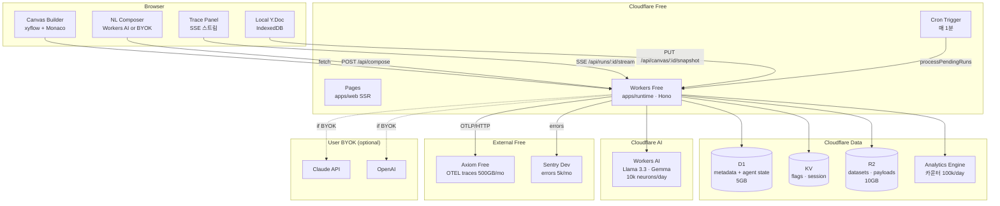
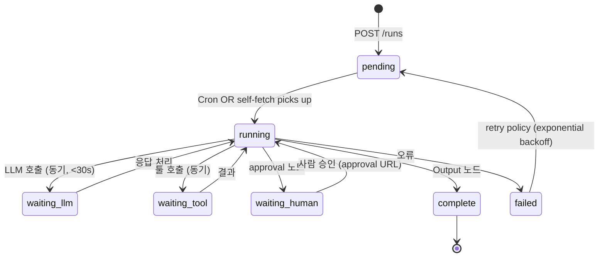
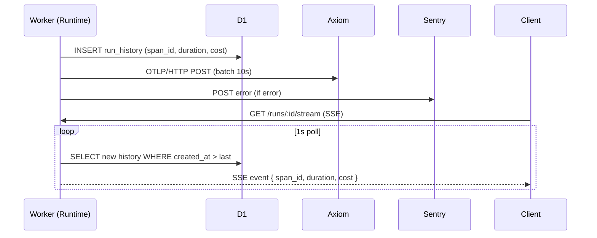

# Architecture

> **$0 Free-tier 정책 (ADR-006)** 기반. 4개 레이어. 관측성은 횡단 관심사.

## 0. 전체 조감도



---

## 1. Canvas Builder (Frontend)

### 책임
- 에이전트 워크플로우 시각 편집 (xyflow)
- 노드별 속성 에디터 (Monaco)
- 자연어 컴포저 (Workers AI 또는 BYOK)
- **Local-first 편집** (y-indexeddb + 3초 디바운스 D1 동기화)
- 관측 패널 (최근 실행 trace SSE 스트림)

**협업 전략**: Phase 1 MVP는 local-first. Phase 2(post-launch)에 Fly.io 무료 VM 3대에 y-websocket 서버 추가 (실시간 presence).
자세히: [ADR-004](./decisions/ADR-004-collaboration-yjs.md)

### 주요 모듈

```
apps/web/
├── app/
│   ├── routes/
│   │   ├── _index.tsx                      # 홈 대시보드
│   │   ├── tools.$toolId.tsx               # 빌더 메인
│   │   ├── tools.$toolId.runs.$runId.tsx   # 실행 상세
│   │   ├── tools.$toolId.eval.tsx          # eval 결과
│   │   ├── tools.$toolId.deploy.tsx        # 배포 · shadow · 승격
│   │   └── admin.*.tsx                     # 조직 · 권한 · 감사
│   ├── components/
│   │   ├── canvas/
│   │   │   ├── NodeCanvas.tsx              # xyflow + y-indexeddb
│   │   │   ├── nodes/{Input,Agent,Tool,Branch,Output}.tsx
│   │   │   └── edges/FlowEdge.tsx
│   │   ├── composer/
│   │   │   ├── NLSidebar.tsx               # 자연어 → 노드 트리
│   │   │   └── DiffPreview.tsx
│   │   ├── editor/
│   │   │   ├── PromptEditor.tsx            # Monaco + 변수 힌트
│   │   │   └── SchemaEditor.tsx
│   │   └── trace/
│   │       ├── TracePanel.tsx              # 빌더 옆 항상 표시
│   │       ├── TimelineView.tsx            # span waterfall
│   │       └── CostHeatmap.tsx
│   └── lib/
│       ├── yjs-provider.ts                 # y-indexeddb + D1 동기화
│       ├── ai-client.ts                    # Workers AI + BYOK 라우팅
│       └── sse.ts                          # 실행 스트림
```

### 상태 관리
- **Zustand** — 캔버스 UI 상태 (선택·줌·필터)
- **TanStack Query** — 서버 상태 (툴 목록, 실행 이력, eval 결과)
- **Yjs + y-indexeddb** — 캔버스 그래프 (local-first)
- **nuqs** — URL 필터 양방향

---

## 2. Agent Runtime (D1 + Cron, not Durable Objects)

> **왜 DO가 아닌가**: Workers Paid 필요 → [ADR-006](./decisions/ADR-006-free-tier-first.md) 거부.
> **대안 상세**: [ADR-002](./decisions/ADR-002-runtime-d1-cron.md)

### 책임
- 에이전트 실행 (LLM + tool 호출 체인)
- 상태 영속 (D1 `agent_runs` + `run_history`)
- Cron 1분 + self-fetch 이중 실행
- 재시도 · 타임아웃 · human-in-the-loop

### 실행 모델



각 transition = 1 Worker invocation. CPU 30s 내 반드시 완료. 긴 체인은 self-fetch로 즉시 연속.

### D1 스키마

```sql
CREATE TABLE agent_runs (
  id              TEXT PRIMARY KEY,           -- ULID
  tool_id         TEXT NOT NULL,
  tool_version    INTEGER NOT NULL,
  org_id          TEXT NOT NULL,
  status          TEXT NOT NULL,              -- pending|running|waiting_*|complete|failed
  input           TEXT NOT NULL,              -- JSON
  current_node_id TEXT,
  state           TEXT NOT NULL DEFAULT '{}', -- JSON (노드별 output 누적)
  next_step_at    INTEGER,                    -- Unix ms, NULL = 즉시 실행
  retry_count     INTEGER DEFAULT 0,
  cost_usd_micro  INTEGER DEFAULT 0,
  trace_id        TEXT,                       -- Axiom 조인 키
  created_at      INTEGER NOT NULL,
  updated_at      INTEGER NOT NULL,
  completed_at    INTEGER
);

CREATE INDEX idx_runs_pending ON agent_runs(status, next_step_at)
  WHERE status IN ('pending', 'running');

CREATE TABLE run_history (
  id              TEXT PRIMARY KEY,
  run_id          TEXT NOT NULL,
  node_id         TEXT NOT NULL,
  node_type       TEXT NOT NULL,
  input           TEXT,                       -- JSON
  output          TEXT,                       -- JSON
  duration_ms     INTEGER,
  cost_usd_micro  INTEGER,
  span_id         TEXT,
  error_message   TEXT,
  created_at      INTEGER NOT NULL
);

CREATE INDEX idx_history_run ON run_history(run_id, created_at);

CREATE TABLE canvas_snapshots (
  canvas_id   TEXT PRIMARY KEY,
  y_state     BLOB NOT NULL,                  -- Y.encodeStateAsUpdate
  updated_at  INTEGER NOT NULL
);
```

### 주요 모듈

```
apps/runtime/
├── src/
│   ├── index.ts                            # Hono app + Cron handler
│   ├── routes/
│   │   ├── runs.ts                         # POST /runs · GET /runs/:id/stream
│   │   ├── canvas.ts                       # PUT /canvas/:id/snapshot
│   │   ├── compose.ts                      # POST /api/compose (NL → nodes)
│   │   ├── eval.ts                         # POST /eval/run
│   │   └── deploy.ts                       # POST /deploy/promote
│   ├── cron.ts                             # scheduled handler
│   ├── executor/
│   │   ├── step.ts                         # executeOneStep()
│   │   ├── graph.ts                        # 다음 노드 계산
│   │   └── self-fetch.ts                   # ctx.waitUntil(fetch) 패턴
│   ├── llm/
│   │   ├── router.ts                       # Workers AI + BYOK 라우팅
│   │   ├── workersai.ts                    # Cloudflare Workers AI 어댑터
│   │   ├── anthropic.ts                    # Claude (BYOK)
│   │   ├── openai.ts                       # OpenAI (BYOK)
│   │   └── cost.ts                         # 토큰 → $ 계산
│   ├── tools/
│   │   ├── registry.ts
│   │   ├── permission.ts
│   │   └── builtin/{http,sql,slack,stripe}.ts
│   └── otel/
│       ├── tracer.ts                       # OTEL SDK (minimal)
│       └── axiom.ts                        # OTLP/HTTP → Axiom
```

### Cron Handler 골격

```typescript
// apps/runtime/src/cron.ts
export async function scheduled(
  event: ScheduledEvent,
  env: Env,
  ctx: ExecutionContext,
) {
  const pending = await env.DB.prepare(`
    SELECT * FROM agent_runs
    WHERE status IN ('pending', 'running')
      AND (next_step_at IS NULL OR next_step_at <= ?)
    ORDER BY created_at ASC
    LIMIT 10
  `).bind(Date.now()).all<AgentRun>()

  await Promise.all(
    pending.results.map(run => executeOneStep(run, env, ctx))
  )
}
```

### Self-fetch 패턴

```typescript
// step 완료 직후 즉시 다음 step 호출 (Cron 1분 대기 회피)
if (!result.done) {
  ctx.waitUntil(
    fetch(`${env.INTERNAL_URL}/internal/runs/${run.id}/step`, {
      method: 'POST',
      headers: { 'X-Internal-Token': env.INTERNAL_TOKEN },
    })
  )
}
```

결과:
- 체인 에이전트도 **초 단위** 진행
- Cron은 **fallback** (self-fetch 실패 시 1분 내 pick-up)

---

## 3. Observability Core

### 책임
- OTEL GenAI 스펙 span → **Axiom Free (500GB/월)**
- 간단 카운터 → Cloudflare Analytics Engine
- 에러 → Sentry Developer (5k/월)
- 실시간 SSE 스트리밍 (D1 row 폴링 기반, client poll 대체)

### 데이터 흐름



### Axiom APL 쿼리 예시

```apl
// 최근 24h 툴별 실패율
['weaver-traces']
| where _time > ago(24h)
| where ['weaver.span_kind'] == "tool"
| summarize
    total = count(),
    errors = countif(status == "error")
  by tool_id = ['weaver.tool_id'], node_label = ['weaver.node_label']
| extend error_rate = errors * 100.0 / total
| order by error_rate desc
```

```apl
// LLM 비용 트렌드 (일별, 모델별)
['weaver-traces']
| where _time > ago(7d)
| where ['weaver.span_kind'] == "llm"
| summarize
    cost_usd = sum(['weaver.cost_usd_micro']) / 1000000.0
  by bin(_time, 1d), model = ['gen_ai.request.model']
| order by _time, cost_usd desc
```

### Span 스키마
OTEL GenAI 표준 준수 — 자세히 [`specs/observability-schema.md`](../specs/observability-schema.md)

---

## 4. Eval Gate

### 책임
- 데이터셋 업로드 (R2) + 버전 관리 (D1)
- 어서션 DSL 평가
- 배포 승격 게이트
- Shadow traffic (프로덕션 요청 N% 복제)

### 실행 (Cron 기반)

```
POST /eval/run (tool, dataset)
   ↓
D1 INSERT eval_runs (status=pending)
   ↓
Cron Trigger: pending eval 집어서 각 case 실행
   ↓
Axiom → 어서션 검사 → D1 UPDATE eval_runs (pass_rate, metrics)
   ↓
Client SSE 스트림으로 진행 상황 수신
```

### 어서션 DSL
[`specs/eval-dsl.md`](../specs/eval-dsl.md) 참고.

### Shadow Traffic 처리

```typescript
// 프로덕션 run 수신 시
app.post('/runs', async (c) => {
  const prod = await startRun(toolId, prodVersion, input, c.env)
  const shadowConfig = await getShadowConfig(toolId, c.env)

  if (shadowConfig && Math.random() < shadowConfig.sampleRate) {
    // ctx.waitUntil로 백그라운드 복제 실행
    c.executionCtx.waitUntil(
      startRun(toolId, shadowConfig.candidateVersion, input, c.env, {
        mode: 'shadow',
        compareWithRunId: prod.id,
      })
    )
  }

  return c.json({ run_id: prod.id })
})
```

---

## 5. 횡단 관심사

### 인증·권한
- **GitHub OAuth** (무료) + optional 이메일 링크 로그인
- **세션**: KV 저장 (7일 TTL, secure cookie)
- **RBAC 3단계**: viewer / editor / admin
- **감사**: D1 `audit_event` 테이블

### 비용 관리
- **툴 예산**: 월 한도 초과 시 D1에서 차단
- **조직 예산**: 유료 cloud-hosted 티어 (Stripe 통합은 Week 12 이후)
- **사전 견적**: 프롬프트 토큰 × 모델 단가 (Workers AI는 neurons 단위)

### 멀티 테넌시
- `org_id` 모든 테이블 FK
- Worker middleware에서 세션 → org_id 바인딩
- 쿼리마다 `WHERE org_id = ?` 강제 (레이어에서 래핑)

---

## 6. 배포 토폴로지

```
GitHub monorepo (apps + packages + self-host)
   │
   ├── GitHub Actions (퍼블릭 레포 무료 무제한)
   │    ├─ typecheck · biome · vitest · playwright
   │    ├─ contract · bundle-size · knip
   │    └─ wrangler deploy (staging 자동, prod 수동 trigger)
   │
   ├── apps/web       → Cloudflare Pages (무료)
   ├── apps/runtime   → Cloudflare Workers (무료)
   ├── apps/docs-site → Cloudflare Pages (무료)
   │
   └── Data
        ├─ D1 (무료 5GB · 25B reads/월)
        ├─ R2 (무료 10GB)
        ├─ KV (무료 100k reads/day)
        └─ Axiom (외부, 무료 500GB/월)
```

## 7. 확장 · Paid 전환 경로

| 축 | 무료 한도 | 도달 시 선택 |
|---|---|---|
| Worker req/day | 100k | Workers Paid $5/월 → DO·Queues 재활성 |
| Agent 실행 지연 | Cron 1분 + self-fetch | DO로 1:1 마이그레이션 (ADR-002에 경로 기술) |
| Trace ingest | 500GB/월 | Jaeger self-host (Oracle Cloud Free ARM) |
| 에러 | 5k/월 | GlitchTip self-host (Fly.io Free) |
| 실시간 협업 | 없음 | Fly.io 3 VM에 y-websocket (무료) |
| 도메인 | `weaver.pages.dev` | `weaver.dev` 등록 ($12/년) |

자세한 경로: [ADR-006](./decisions/ADR-006-free-tier-first.md)

---

## 8. 보안 고려

- **Workers secrets** — `wrangler secret put`으로 시크릿 주입 (빌드 아티팩트에 노출 없음)
- **Row-level security** — 모든 쿼리에 `WHERE org_id = ?` 래핑 (`packages/core/db/guard.ts`)
- **Permission tokens** — 툴 호출은 HMAC 서명 + scope 검증
- **PII 마스킹** — trace 페이로드에서 이메일·전화·카드번호 자동 제거
- **Rate limit** — KV 기반 org 단위 rate limit (기본 100 runs/min)
