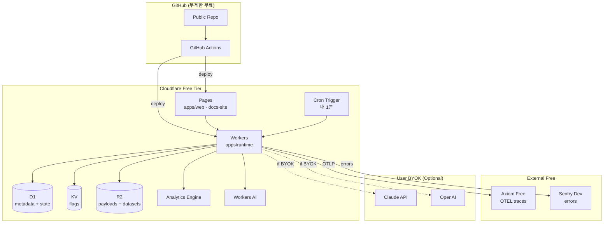

# Tech Stack

> **$0 Free-tier First 정책 (ADR-006)**. 트렌디 2026 스택 유지, 고정 월 비용 0원.

## 0. 원칙

1. **런칭까지 $0** — 카드 등록 없이 동작
2. **자체 호스팅 1:1 대안 필수** — 유료 SaaS 쓰더라도 OSS 자체 호스팅 경로 문서화
3. **BYOK (Bring Your Own Key)** — Claude/OpenAI는 유저가 자기 키로 사용
4. **Paid 전환은 트리거 기반** — 트래픽이 무료 한도에 닿으면 의사결정

## 1. 전체 요약 테이블

| 레이어 | 선택 | 무료 한도 | Paid 전환 트리거 | 대안 거부 |
|---|---|---|---|---|
| **언어** | TypeScript 5.9 strict | — | — | JS+JSDoc: 대규모 리팩토링 불가 |
| **빌드** | Vite 6 | — | — | Webpack: 느림 / Turbopack: 미성숙 |
| **Lint/Format** | Biome 2 | — | — | ESLint+Prettier: 10-50배 느림 |
| **모노레포** | pnpm workspaces 9.15 | — | — | Nx/Turborepo: 규모 대비 오버 |
| **프런트 프레임워크** | React Router v7 Framework Mode | — | — | Next.js: Cloudflare 2차 시민 |
| **UI** | shadcn/ui + Radix UI 16 | — | — | MUI/Ant: 번들 크고 테마 한계 |
| **스타일** | Tailwind CSS 4 | — | — | CSS Modules: 생산성 ↓ |
| **캔버스** | xyflow v12 | — | — | tldraw: 그래프 모델 부재 |
| **에디터** | Monaco | — | — | CodeMirror 6: VS Code 생태 떨어짐 |
| **CRDT** | Yjs + y-indexeddb | — | — | Automerge: xyflow 통합 난이도 |
| **폼** | react-hook-form + valibot | — | — | zod: 번들 10배. Formik: 렌더 비효율 |
| **클라 상태** | Zustand 5 | — | — | Redux: 보일러플레이트 |
| **서버 상태** | TanStack Query v5 | — | — | SWR: 기능 부족 |
| **URL 상태** | nuqs 2 | — | — | useSearchParams: 타입 불안 |
| **엣지 런타임** | Cloudflare Workers (Free) | 100k req/day | DAU 5k+ | Lambda: cold start, 엣지 아님 |
| **HTTP 프레임워크** | Hono 4 | — | — | Express: Node 전용 |
| **ORM** | Drizzle ORM | — | — | Prisma: Edge 호환 약함 |
| **메타 DB** | Cloudflare D1 (SQLite) | 5GB + 25B reads/월 | 툴 10만개+ | Postgres: 엣지 아님 |
| **파일** | Cloudflare R2 | 10GB + 1M Class A ops | 100만 파일+ | S3: egress 비용 |
| **KV** | Cloudflare KV | 100k reads/day | 세션 폭증 | Redis: 호스팅 필요 |
| **백그라운드** | Cloudflare Cron Triggers | 무료 | 실행 10k/day+ | Queues: Workers Paid 필요 |
| **AI 기본** | Workers AI (Llama 3.3/Gemma/Mistral) | 10k neurons/day | 상업화 → BYOK | OpenAI: 유료 |
| **AI 고품질** | 유저 BYOK (Claude/OpenAI) | 유저 부담 | — | — |
| **Embedding** | Workers AI (bge-base-en-v1.5) | 무료 tier 포함 | — | — |
| **Trace 저장** | Axiom Free | 500GB/월 | 초과 시 Jaeger self-host | ClickHouse Cloud: $30/월 |
| **에러** | Sentry Developer | 5k errors/월 | GlitchTip self-host | Sentry Team: $26/월 |
| **CWV** | Cloudflare Web Analytics | 무료 | — | Google Analytics: 무료지만 privacy |
| **간단 카운터** | Cloudflare Analytics Engine | 100k writes/day | 초과 시 자체 집계 | — |
| **시크릿** | `wrangler secret` + `.dev.vars` | 무료 | 팀 증가 | Doppler Team: 유료 |
| **테스트 unit** | Vitest 3 + @testing-library | — | — | Jest: Vite 네이티브 아님 |
| **테스트 E2E** | Playwright 1.5x (빌트인 visual) | — | — | Cypress: 느림. Chromatic: 유료 |
| **API 모킹** | MSW 2 | — | — | Mirage: Service Worker 아님 |
| **번들 게이트** | size-limit + knip + Lighthouse CI | — | — | — |
| **CI** | GitHub Actions (퍼블릭 레포) | **무제한** | — | CircleCI: 6k min/월 한도 |
| **배포 CLI** | Wrangler 4 | — | — | — |
| **도메인** | `weaver.pages.dev` | 무료 서브도메인 | 수익 후 `weaver.dev` | — |

## 2. 핵심 선택 근거 상세

### 2.1 왜 Cloudflare Workers Free (아니라 Vercel/Lambda)?

- **$0**: 100k req/day = DAU 약 5,000명까지 충분
- **글로벌 엣지**: 300+ PoP, cold start <100ms
- **생태계 일체형**: D1·R2·KV·Workers AI·Analytics Engine이 한 계정
- **IaC 가벼움**: `wrangler.toml` 한 파일
- **Durable Objects 제외** — Paid 필요 → ADR-002에서 D1 + Cron으로 대체

### 2.2 왜 Workers AI를 기본 LLM으로?

- **무료 10k neurons/day** = 작은 모델 수천 콜 (MVP 충분)
- **낮은 지연** — Cloudflare 엣지에서 실행
- 제공 모델: Llama 3.3 70B · Gemma 2 · Mistral 7B · Qwen · 여러 임베딩 모델
- **BYOK 오버라이드** — 고품질 필요 시 유저가 Claude/OpenAI 키 입력
- **MCP 호환** — Anthropic MCP 서버를 tool로 마운트 가능

### 2.3 왜 Axiom (아니라 ClickHouse Cloud)?

- **Free 500GB/월** ingest — MVP에서 무한 수준
- **OTEL 네이티브** 수신 (OTLP/HTTP)
- **APL 쿼리 언어** — ClickHouse SQL 대비 간결
- **대시보드·알림 포함**
- 한계 시점: 월 500GB 초과 → Jaeger self-host (OSS)

### 2.4 왜 D1 + Cron (DO 아닌)?

**상세 근거는 [ADR-002](./decisions/ADR-002-runtime-d1-cron.md) 참고.**

- DO는 Workers Paid $5/월 필수 — ADR-006 거부
- D1 transaction + Cron 1분 + self-fetch 패턴으로 동등 기능
- 확장 시 DO로 1:1 마이그레이션 경로 열려 있음

### 2.5 왜 GitHub Actions (아니라 CircleCI)?

- **퍼블릭 레포 무제한 무료** — OSS 프로젝트에 이상적
- CircleCI 6,000 min/월 한도 도달 위험 (매 PR × 여러 job)
- GitHub 네이티브 체크/PR 통합

### 2.6 왜 Biome (아니라 ESLint+Prettier)?

- 10-50배 빠름 → CI 단축
- 단일 도구, 설정 단순
- 주의: RR7 `react-hooks/rules-of-hooks` 같은 특화 rule은 ESLint 병행 검토

## 3. 의존 관계 토폴로지 (무료 tier만)



## 4. 비용 테이블

### MVP (유저 100명 · 실행 10k/월)

| 항목 | 월 비용 |
|---:|---:|
| Cloudflare Workers · Pages · D1 · R2 · KV · Cron · AE · WAI | **$0** |
| Axiom Free (OTEL traces) | **$0** |
| Sentry Developer (errors) | **$0** |
| GitHub Actions (퍼블릭 레포) | **$0** |
| Wrangler · Biome · Vitest · Playwright · MSW | **$0** |
| `weaver.pages.dev` 서브도메인 | **$0** |
| Doppler (없음 — `wrangler secret` 사용) | **$0** |
| **합계** | **$0/월** |

### 성장 단계 (유저 5,000명 · 실행 500k/월)

이 시점엔 매출(유료 cloud-hosted $49/팀) 발생 전제. Paid 전환 예산 확보.

| 항목 | 월 비용 | 비고 |
|---|---:|---|
| Workers Paid + DO + Queues | $5 | DO 복원 |
| Axiom Pro (필요 시) | $25 | 또는 Jaeger self-host $0 |
| Sentry Team | $26 | 또는 GlitchTip self-host $0 |
| Fly.io (y-websocket 서버) | $0 | 무료 3 VM 유지 |
| 커스텀 도메인 | $1 | $12/년 |
| **합계** | **~$57/월** | 전부 self-host 시 **~$1/월** |

## 5. Self-host 대안 (엔터프라이즈 제안 시)

유료 의존이 불안한 고객용 완전 자체 호스팅 레시피:

| SaaS | OSS 자체 호스팅 | 배포 |
|---|---|---|
| Axiom | **Jaeger** + **ClickHouse** | Docker Compose (Oracle Cloud Free 4 vCPU 24GB) |
| Sentry | **GlitchTip** (Sentry API 호환) | Fly.io or Docker |
| Cloudflare Workers AI | **Ollama** (Llama 3.3 / Gemma) | 온프레미스 GPU or CPU |
| Workers 자체 | **Cloudflare Workers OSS runtime (workerd)** | Docker |

가이드는 `docs/self-host/` 폴더 (Week 14 런칭 준비 시 작성).

## 6. 재활용률 (박진희 maps-platform 기준)

| 영역 | 재활용도 |
|---|---|
| React Router v7 Framework Mode | 100% |
| shadcn/ui + Tailwind 4 | 100% |
| Zustand + TanStack Query + nuqs | 100% |
| Cloudflare Workers + D1 + R2 + KV | 100% |
| Vitest + Playwright | 100% |
| OpenTelemetry (GenAI 스펙은 신규) | 80% |
| GitHub Actions (maps는 CircleCI지만 호환) | 90% |
| Drizzle ORM | 신규 (maps는 JPA) |
| xyflow · Yjs · Hono · Workers AI · Axiom · valibot | 신규 학습 |

**신규 학습 전부 2026 AI 시대 중심 기술** — 투자 = 이력서 업그레이드.

## 7. 모노레포 구조

```
weaver/
├── apps/
│   ├── web/                         # RR7 빌더 UI (Cloudflare Pages)
│   ├── runtime/                     # Hono + Cron (Cloudflare Workers)
│   └── docs-site/                   # Astro + Starlight (Cloudflare Pages)
├── packages/
│   ├── core/                        # 타입 · valibot 스키마
│   ├── canvas/                      # xyflow 노드 + y-indexeddb hook
│   ├── runtime/                     # AgentExecutor (DO/D1 구현 추상화)
│   ├── observability/               # OTEL exporter + Trace Viewer
│   └── eval/                        # eval DSL 파서 + runner
├── self-host/                       # Docker compose 등 (Week 14)
├── docs/
├── specs/
├── brand/
├── .github/
│   └── workflows/                   # CI = GitHub Actions
├── biome.json
├── package.json                     # pnpm workspaces
├── pnpm-workspace.yaml
└── tsconfig.base.json
```
